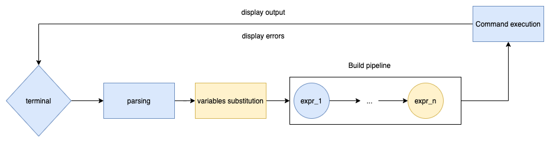
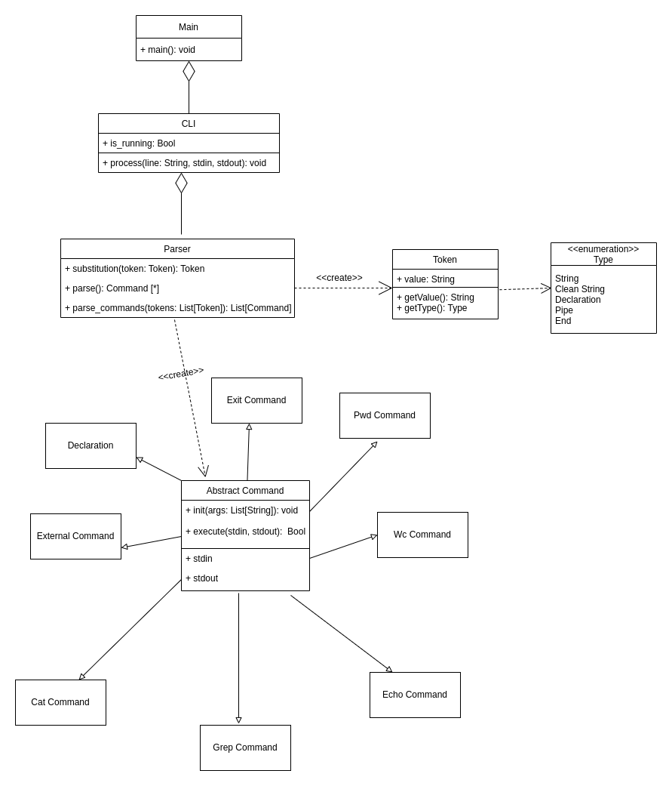

# Software Development course

## Инструкция сборки

Установка зависимостей: `pip install -r requirements.txt`

Запуск программы: `python3 -m CLI.main`

Запуск тестов: `python3 -m pytest tests/`
`

## Описание архитектуры:

В методе `Main` реализован основной цикл программы. Он считывает входную строку из терминала и передает ее парсеру.
После этого последовательно вызываются методы классов, описанных далее.

Класс `Parser` содержит метод `parse`, выполняющий разбор командной строки на список сущностей (класс `Token`), которые
могут представлять собой:

* чистая строка - строка, в которой нет подстановок
* строка
* `=` - объявление переменной
* `|` - пайплайн
* конец строки

Класс `Token` имеет методы `getType()` и `getValue()`, возвращающие тип и значение токена. Поддерживает разбор и `''`,
и `""`: `''` интерпретируется буквально, а `""` позволяют расширение переменной, `$` осуществляет подстановку
переменных.

### Алгоритм разбора:

Разбиваем строку на список токенов следующим образом:
Имеем `ordered dict: {токен:регулярка для него}`, а именно:

* `PIPE`: `'\|'`
* `DECLARATION`: `'='`
* `CLEAN_STRING`: `'\'[^\']*\''`
* `STRING`: `'(\"[^\"]*\")|([\w\-\.\!\@\?\#\$\%\^\&\/\*\(\)\-\+]+)'`
* `END`: `chr(0)`

Проходим по порядку по дикту и смотрим, что с текущей позиции регулярка что-то захватывает. Если регулярка что-то съела,
то мы распарили токен и начинаем сначала на остатке строки.

Далее запускаем на нем алгоритм обработки:

В начале обработки для каждого токена проверяется, не является ли токен подстановкой - тогда из словаря переменных
извлекается значение по ключу (все символы после `$`до пробела - название переменной), если переменная не определена -
пустая строка. Всё что находится в одинарных кавычках разбирается как есть и является строкой, а в двойных
осуществляется проверка: содержится ли подстановка переменной (если есть, то происходит подстановка).

Первый токен в списке токенов - название команды, либо название переменной. Сначала проверяется, является ли выражение
присваиванием, а именно, проверяется, что следующим токеном является `=`. Считаем, что название переменной - токен до
знака `=`, значение переменной - выражение справа от `=` (список токенов от следующей позиции до токена пайпа или конца
строки). Замечание:
Поддерживаются только случаи, когда до знака `=` и после него ровно 1 токен. Присваивания в пайпе не поддерживаются В
этом случае создается экземпляр класса `Command` (`declaration`)..

Если следующий токен не `=`, это должна быть команда, и если данное название присутствует в списке поддерживаемых
команд, то вызывается соответствующий метод `buildCommandByName`, принимающий список аргументов (список токенов от
следующей позиции до токена пайпа или конца строки). Иначе создается экземпляр класса `Command`, который ответственен за
запуск подпроцесса.

Последовательность токенов обрабатывается в классы `Command`, разделяясь по символу `|`. Компонента `Commands` содержит
описание того, как должны исполняться соответствующие команды. Каждая команда представляется отдельным
классом `CommandName`, который наследуется от абстрактного класса `Command`. Каждый класс имеет метод `execute()`,
который возвращает 0 в случае успешного исполнения. Также в этом классе имеются следующие поля: `stdin` и `stdout`,
которые отвечают за потоки ввода-вывода.

После разбора токенов выполняется вычисление команд по порядку. `stdout` выполненной команды становится `stdin`'ом
следующей.
`stdin` первой команды привязывается на время выполнения на `stdin` исполнительной системы (`python: sys.stdin`)
, `stdout` для последней команды соответствующе.

### Наследники абстрактного класса Command

* Команда `cat [FILE]` выводит на экран содержимое файла, переданного в качестве аргумента. Если файл отстутствует, то
  тогда содержимое читается из потока ввода. Если же он пуст, то запускается интерактивный режим и выводит
  пользовательский ввод.
* Команда `echo`  - выводит на экран свой аргумент (или аргументы), если список аргументов пуст, то выводит пустую
  строку.
* Команда `wc [FILE]` выводит количество строк, слов и байт для файла. Если файл отстутствует, то тогда содержимое
  читается из потока ввода. Если же он пуст, то запускается интерактивный режим и выводит количество строк, слов и байт
  пользовательского ввода.
* Команда `pwd` печатает абсолютный путь до текущей директории.
* Команда `exit` завершает работу интерпретатора, а именно присвоим значение False переменной is_running, которая
  отвечает за работу нашего интерпретатора. Соответственно в методе Main будет `while is_running`.
* Команда `declaration` присваивает значение переменной. Соответственно, ее аргументы - название и значение переменной.
  Всё записывается в глобальный словарь `{"название переменной": "её вычисленное значение"}
* Команда `external` - вызов внешних команд в случае, если введено что-то, что интерпретатор не знает. Создается новый
  поток, в котором выполняется процесс требуемой команды.  `stdin` передается либо с прошлой команды, либо подвязывается
  в `stdin` исполнительной системы, `stdout` аналогично. Все переменные передаем в окружение нового процесса. При
  запуске внешней программы синхронно ждём, пока она завершится. `stderr` внешней программы перехватывается и, если он
  не пустой, то выводится сообщение в консоль. `execute` возвращает код возврата внешней программы.
* Команда `grep`- ищет в наборе файлов или стандартном вводе (если файлы отстутствуют) строчки с заданной подстрокой или регулярным выражением и выводит их на экран.  Данная команда поддерживает следующие ключи:
  * -w - поиск слова целиком
  * -i - регистронезависимый поиск
  * -A - следующее за -A число говорит, сколько строк после совпадения надо распечатать
  * -E - поиск регулярного выражения

Дожидаемся завершения команды. При успешном завершении (код возврата = 0) - ничего не делаем, при неудаче - обрабатываем
исключение и сообщаем пользователю.

Если переменные объявляются в пайплайне или встречается команда `exit`, то они будут проигнорированы.

После исполнения всех необходимых команд, отображаем результат.

В процессе выполнения каждого шага обрабатываем ошибки.

### Библиотека для разбора аргументов командной строки

Мы выбирали междву `arparse` и `click`.
Нами была выбрана библиотека `argparse` по следующим причинам:

- у нас был опыт ее использования
- легко интегрируется в наше приложение, есть все необходимые возможности
- понятная документация и использование

